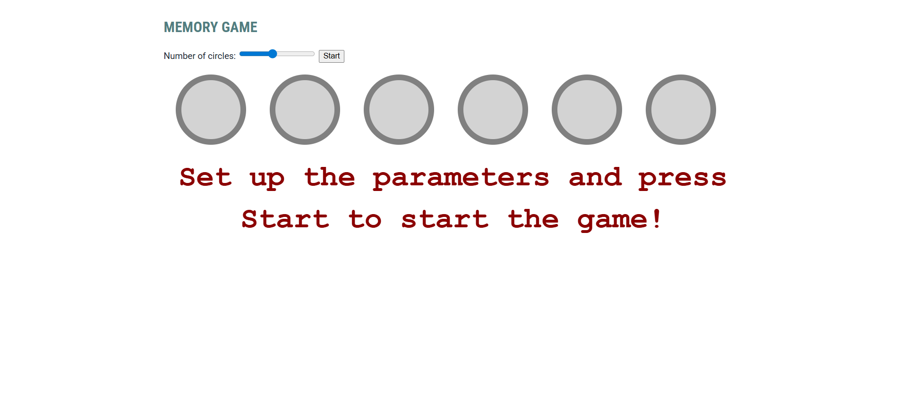

# Memory Sequence Game

A browser-based memory game built with HTML, CSS, and vanilla JavaScript.

The player watches a sequence of flashing circles and then tries to reproduce the same order from memory.

This project demonstrates DOM manipulation, event handling, timed sequence playback, state management, and interactive game logic.

---

# Project Overview

This is a simple memory game where the player must remember the order of highlighted circles and replay the sequence by clicking the circles in the same order.

The number of circles can be adjusted with a slider before starting the game. After pressing the Start button, the application generates a random sequence, flashes the circles one by one, and then allows the player to enter their answer.

---

## Preview



---

---

## 🎮 Play the Game Online

You can play the game directly in your browser without downloading anything:

👉 **[Click here to play](https://jafarhasanli.github.io/memory-sequence-game-js/)**

---

# Features

- Adjustable number of circles
- Randomly generated memory sequence
- Timed flashing animation
- User input handling through circle clicks
- Sequence comparison logic
- Game result feedback
- Input locking while the sequence is playing
- Clean and simple UI

---

# How the Game Works

1. Select the number of circles using the slider
2. Press the **Start** button
3. The game generates a random sequence of 7 numbers
4. The circles flash one by one in that order
5. After the animation ends, the player clicks the circles in the remembered order
6. The game checks whether the input matches the generated sequence
7. The result is shown as:
   - **Nice job!**
   - **Failed!**

---

# Technologies Used

- HTML5
- CSS3
- JavaScript (Vanilla JS)

---

# File Structure

```
memory-sequence-game-js/
├── index.html
├── index.css
├── index.js
├── assets/
│   └── preview.png
├── README.md
├── .gitignore
└── LICENSE
```

---

# JavaScript Concepts Demonstrated

This project demonstrates:

* DOM querying and rendering
* dynamic element generation
* event handling
* state control with boolean flags
* array-based sequence generation
* timed recursion with `setTimeout`
* animation class toggling
* interactive game flow management

---

# CSS Highlights

The interface includes:

* circular interactive game elements
* animation-driven highlighting
* active click feedback
* large result text output
* simple responsive layout with flexbox

---

# How to Run

## Option 1: Open directly in browser

Open `index.html` in a browser.

## Option 2: Use VS Code Live Server

You can also run the project with the Live Server extension in Visual Studio Code.

---

# Possible Improvements

* Add score tracking
* Increase sequence length by difficulty
* Add levels
* Add sound effects
* Add restart button
* Add countdown before playback
* Show clicked sequence to the player
* Add mobile-friendly layout improvements

---

# Academic Context

This project was created as a university JavaScript assignment focused on event-driven programming, DOM updates, and timed interaction logic.

---

# Author

Jafar Hasanli
Computer Science Student
Eötvös Loránd University (ELTE)
